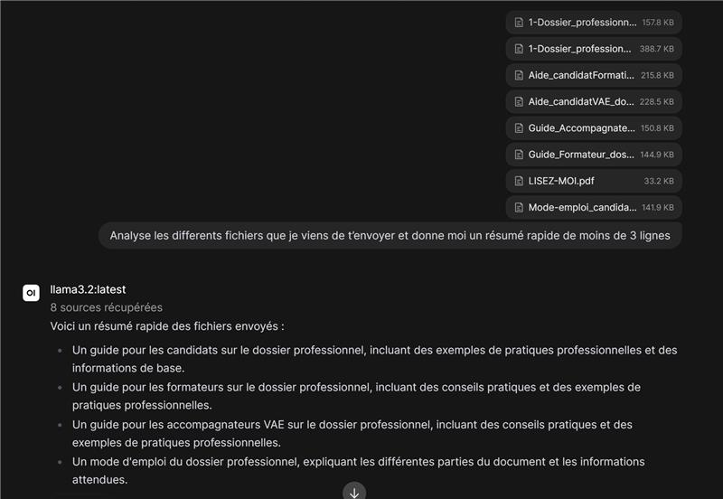

# TP LLM EN GROUPE

**Réponses aux questions :**

-Installer docker sur le serveur, afin d'isoler le service WebGui, puis installer WebGui dessus. Enfin, permettre WebGui et Ollama de communiquer, notamment en ouvrant un port sur WebGui en l'occurence : http://host.docker.internal:11434, donc ouverture du port 11434
 
 
-Oui il est possible de modifier le contexte d'une IA, notamment directement via le prompt lorsque l'on communique avec elle. Différents paramètres modifiables par exemple sont : PARAMETER temperature 0.7      # créativité (0 = déterministe, 1+ = créatif) PARAMETER top_p 0.9            # diversité du vocabulaire PARAMETER num_predict 2048     # longueur max de la réponse générée PARAMETER repeat_penalty 1.1   # évite les répétitions
 
-Il est possible de fournir un dossier avec plusieurs fichiers à une IA, en l'occurence ici nous lui avons fournis plusieurs PDF, qu'il a su lire et résumé en quelques lignes :

 
-Oui il est possible de créer un "Modelfile", qui se résume à une sorte de fichier de configuration, dans lequel nous allons mettre des paramètres précis pour nos réponses souhaitées par l'IA. Ensuite, nous allons indiquer au modèle de s'appuyer sur ce fichier de "configuration" pour les réponses futures
 
-Voir réponse 3.
 
-Notre LLM locale n'a pas accès à la recherche web, il tire ses réponses de ses connaissances web qui datent de fin 2023. Si l'on veux des réponses plus récentes, il faut activer la recherche web dans les paramètres WebGui par exemple, en indiquant une clé API d'un des moteurs de recherche. A noter que cela sera payant dans la plupart des cas.
 